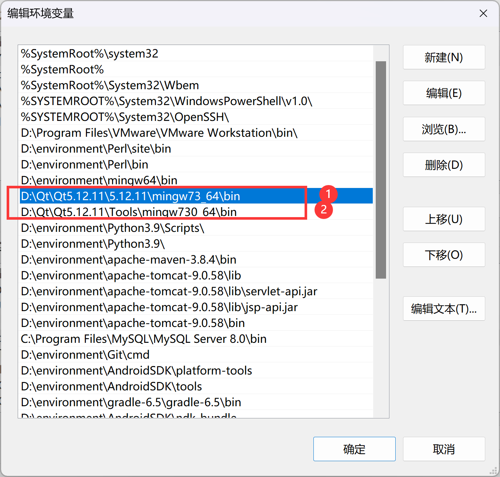

# Demo
## 适用于VsCode的QT(qmake)工程

环境（Environment）：

📌Windows11

📌Qt5.12.11+ MinGW64 编译套件

📌VsCode (version = 1.78.2)

---

### 一、命令行编译运行QT程序

在使用VsCode配置QT程序之前，我们应该需要知道如何通过命令行来编译以及运行QT工程。

下面是我个人常用的方式，可以参考：

#### 1. 使用QtCreator创建一个qmake工程。


#### 2. 使用qmake命令生成Makefile文件

- 打开工程目录 (.pro所以位置)

- 在工程目录下进入终端（当然也可以先打开终端，然后cd 到你的工程下）

- 创建一个build文件夹，这样可以避免编译生成的文件散落在工程目录下

- 进入到build文件夹

- 执行`qmake ../XXX.pro` (因为.pro文件是在build文件夹的上一层)

- 执行`mingw32-make -j16 debug`

- 进入build下的debug文件夹，此时可以看到生成了xxxx.exe可执行文件

- 双击 xxx.exe 运行，自此结束。

  可能遇到的错误：

  ```shell
  PS D:\Desktop> qmake ../Demo.pro
  qmake : 无法将“qmake”项识别为 cmdlet、函数、脚本文件或可运行程序的名称。请检查名
  称的拼写，如果包括路径，请确保路径正确，然后再试一次。
  ```

  如果你遇到了上面情况，请注意检查是否添加下面两条环境变量

  - qmake.exe 所在的bin目录

  - mingw32-make.exe 所在的bin目录

    


---

### 二、配置VsCode+QT

#### 1.安装VsCode插件

- 确保你的VsCode程序中安装有C\C++ Extension Pack插件，如下图

  

#### 2.使用VsCode打开你的QT工程

- 演示如下

  

  😫打开之后，点开main.cpp，此时应该会看到，头文件的部分报错。请看下面第2点解决。

#### 2.添加包含的头文件路径，即include文件夹所在位置

如果指定头文件的路径，VsCode就不知道你的代码里面的头文件是在哪里，导致代码报红

这是我QT的mingw64编译套件对应的头文件路径 `D:\\Qt\\Qt5.12.11\\5.12.11\\mingw73_64\\include\\**`

请根据自己的来修改。

- 记得把路径的`\`更换成`\\`或者用`/`表示

- 记得在include后面加上两个*，表示遍历这个目录下的所有头文件（不知道的话，照着做就行了）

  演示如下：

  


#### 3.配置launch.json和tasks.json

- 在`.vscode`文件夹下创建`tasks.json`(如果没有这个目录就自己建一个)

- 将下面内容粘贴到tasks.json文件里

  ```json
  {
      "tasks": [
          
          // 任务：qmake 根据.pro文件生成 Makefile，通常是.pro文件改动后才需要执行
          //      这个任务的执行等效命令行 >> cd build
          //                           >> qmake ../Demo.pro
          {
              "type": "shell",
              "label": "qmake",
              "options": {
                  
                  // cwd的意思是执行这个命令的时候，所在的目录
                  // 这里我们指定为工程目录下的build文件夹，这样的话
                  // 当执行qmake的时候，产生的中间文件就在build文件夹下面了
                  "cwd": "${workspaceFolder}\\build"
              },
              "command": "qmake",  //command 命令，这个不用说了
              "args": [
                  // qmake后面跟的参数，因为上面cwd配置为build目录，
                  // 所以.pro文件应该在build的上一级，所以使用../*.pro
                  "../*.pro" 
              ],
          },
          
          // 任务：编译 每次修改代码后都需要执行
          //      任务等效命令行  >>make -j16 debug
          {
              "label": "make",
              "options": {
                  "cwd": "${workspaceFolder}\\build"
              },
              "group": {
                  "kind": "build",
                  "isDefault": true
              },
              "command": "make",
              "args": [
                  "-j16",
                  "debug"
              ],
              "dependsOn": [
                  //"qmake"
              ]
          },
          
          // 任务：清理 等效命令行 make clean
          {
              "label": "clean",
              "options": {
                  "cwd": "${workspaceFolder}\\build"
              },
              "command": "make",
              "args": [
                  "clean"
              ]
          },
          
          // 运行程序
          {
              "label": "run",
              "options": {
                  "cwd": "${workspaceFolder}\\build\\debug"
              },
              "command": "${workspaceFolderBasename}.exe", 
              "args": [
                  ""
              ],
              "dependsOn": [
                  "make"
              ]
          }
      ],
      "version": "2.0.0"
  }
  ```

  配置tasks.json演示如下：

  

- 在.vscode文件夹下新建launch.json 并且粘贴下面内容

  ```json
  {
      "version": "0.2.0",
      "configurations": [
          {
              "name": "gdb",
              "type": "cppdbg",
              "request": "launch",
              "program": "${fileDirname}\\build\\debug\\Demo",//程序可执行文件的完整路径。
              "args": [],
              "stopAtEntry": false,
              "cwd": "${fileDirname}",
              "environment": [],
              "externalConsole": false,
              "MIMode": "gdb",
              //"miDebuggerPath": "D:\\Qt\\Qt5.12.11\\Tools\\mingw730_64\\bin\\gdb.exe",
              "setupCommands": [
                  {
                      "description": "为 gdb 启用整齐打印",
                      "text": "-enable-pretty-printing",
                      "ignoreFailures": true
                  }
              ],
              // 调试之前先编译一下,即对应tasks.json任务中的make
              "preLaunchTask": "make"//与tasks.json文件里的label名对应
          }
      ]
  }
  ```

  配置launch.json演示如下：

  

  

---

### 三、运行与调试

#### 1.运行程序

- 点击VsCode顶部菜单栏的终端>>运行任务>>qmake

- 同样点击顶部菜单栏的终端>>运行任务>>make

- 终端>>运行任务>>run

  演示如下：

  

#### 2.调试程序

- 万能的VsCode怎么能少了调试呢 😁

  演示如下:

  

  

  

- 演示用的Demo工程已上传至
[GitHub](https://github.com/EA-LGX/Demo/tree/master)\[Gitee]([https://github.com/EA-LGX/Demo/tree/master](https://gitee.com/lu_guang_xing/Demo))
  ## 自此完结，撒花！！！🎉🎉🎉
